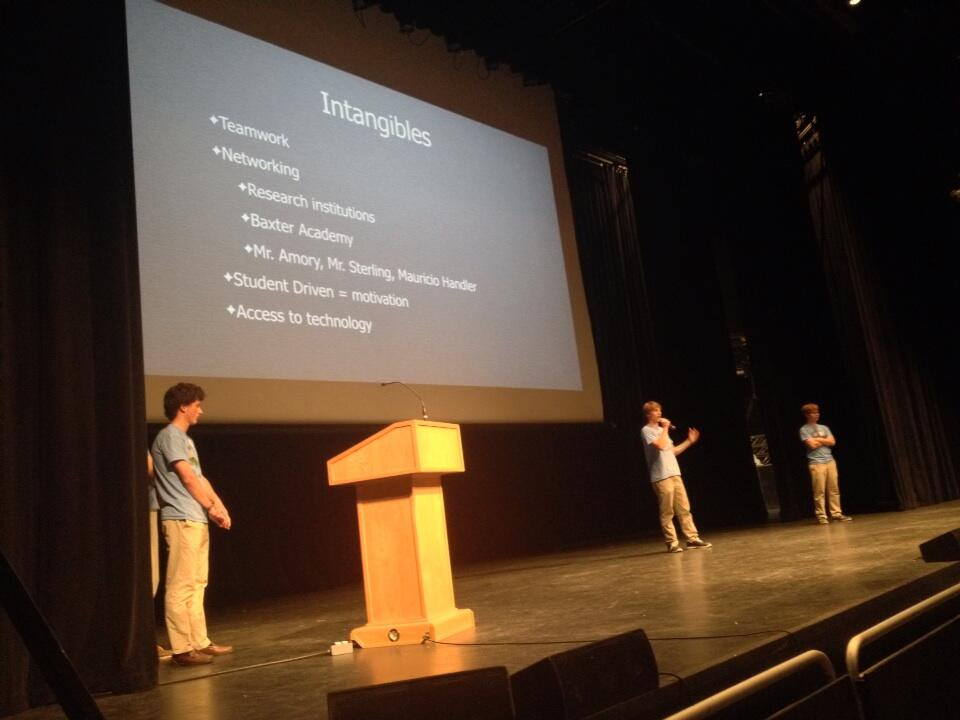

## Initiation
It is impotant that you have the right team if you are going to teach the
students how to code. Prior to the formal coding club starting we have
participated in lots of different learn to code events like Hour of Code.
These events can be tought and facilitated by technical people who don't
necessarily come from a software background. These events showed us
the need for defining what you want to be.

### Teachers
Before initiating the club you need to decide who will be helping
teach/facilitate. If you have a professional software engineer then
you may want to skew the club to things they are comfortable and interested in.
If you have a parent or teacher who is interested in volunteering but will be
learning themselves they you probably want to stick with the standard programs
build around Code.org or the MIT Scratch labs and keep it more classroom-like.
If you have someone handy with electronics then you can skew the club toward
IOT projects. Either way, once you have a key technical volunteer it is helpful
to have another parent or teacher to help facilitate the sessions - especially
if you have more than 5 or 6 students participating.  We have found continuity
is critical and it is very hard to have rotating technical leads unless
you have a rigid curriculum.  Letting a single technical lead faciliate
the club allows the club to be shaped by the students.

### Students
There are a lot of considerations when it comes to shaping the participation
in the club.  Early in our club we just threw it out as a possibility and we
found some things that should be predictable.
- By default you will probably get a very uniform group of kids in all ways.
Lesson here is that you need to explicitly recruit for diversity and make
it fun for everyone.  Focusing on the kids who already tinker is not good
for anyone.
- Every year there will be a different profile so we decided to make the
curriculum flexible, but still have continuity.  But if it is not interesting
to some of the students we have stuck with the plan and been ok with
losing some participation
- Judge the ability of the team to focus and execute - facilitate based on that.
Some years we have totally opened up the curriculum and let the creativity
of the kids drive the project. Other times it is best to be focused and
disciplined to avoid endless tinkering with little learning.

### Style
You have to decide the style of the club. We have tried it all:
- Lecture Style: Each class is a lecture about a topic followed by some
practical work
- On the job training: This style of facilitation is where you carefully
pick projects of escalating challenge that introduce concpepts slowly
then use them in different ways.
-Project style: This style is where the club makes an audactious goal and
breaks it into parts then executes over the course of the weeks or months.

Our club decided early on to be flexible.  Lecture-style for an afternoon
coding club is very challenging so we tend to keep that to a minumum that
and reserve lectures for when we have some complicated conepts to introduce.
In those examples we quickly follow the lecture with fun practicals.  An
example of this is the sorting exercise.

The project style is similarly challenging. This works better with older
students who have some experience or with extremely focused and motivated
students. We have done this with mixed results but in concept it is our
desire to get the students to a point they can take on bigger projects on
their own. A good use case for that was the Limbeck Engineering submersible
project: 
